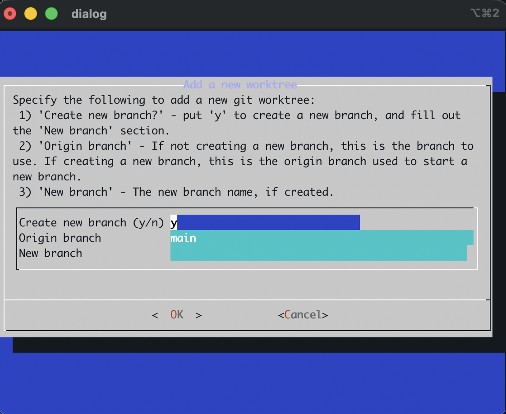
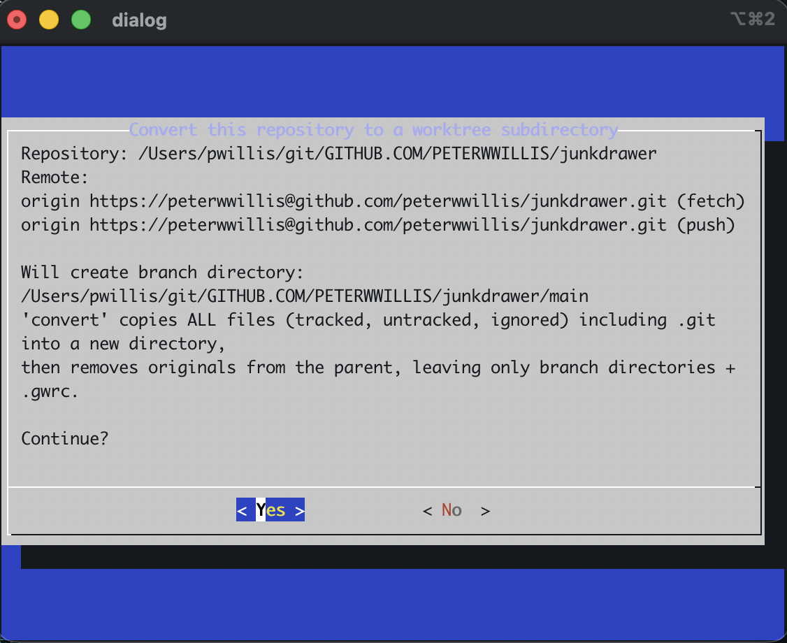
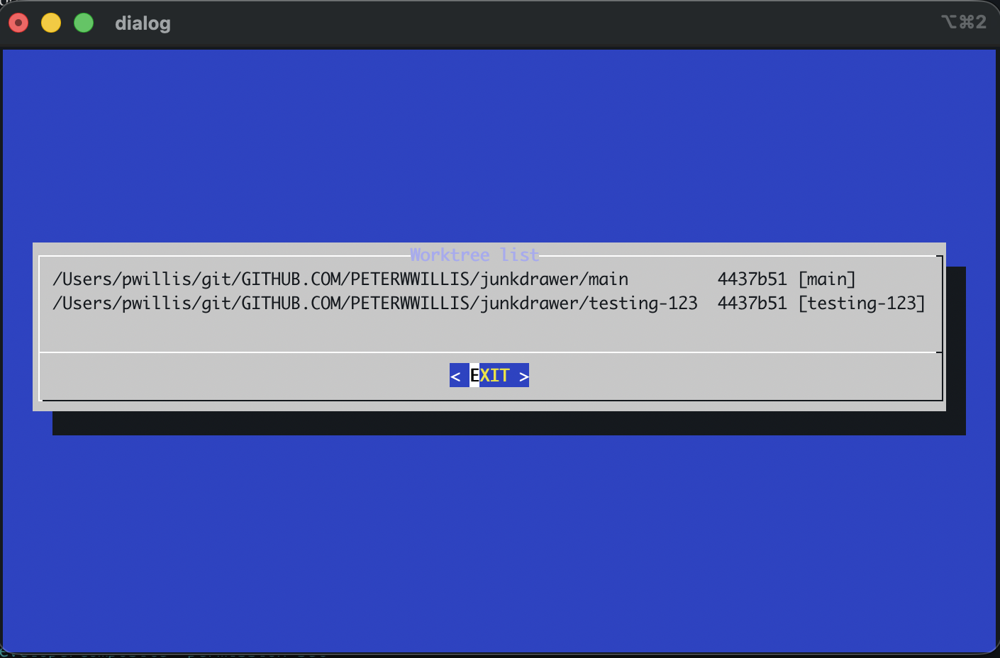
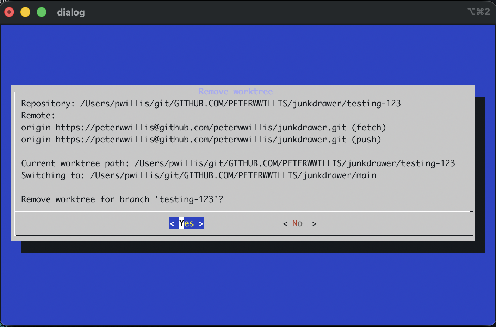

# git-worktree-switcher (gw)

`gw` is a Bash wrapper around `git worktree` that uses `dialog` to provide
simple, TUI-driven workflows.

You can switch between worktrees, add new worktrees, convert a repo into a worktree-friendly layout, and remove worktrees.

It is designed to be sourced into your shell so it can `cd` into selected worktree directories automatically. The script is written with Bash in mind, but tries to use POSIX semantics whenever possible, so it should work in other shells (as yet untested).

## Requirements

- git, dialog, Bash 3.x or later

## Installation & Usage

1. Make sure `git` and `dialog` are installed.
2. Copy `gw.sh` somewhere on your system.
3. Source it in your shell:
    ```bash
    source /path/to/gw.sh
    ```
4. Use the `gw` command:
    ```bash
    gw [COMMAND]
    ```

### Commands

- `switch` (or `sw`) – Select and switch to a worktree directory.
- `add` (or `a`) – Add a new worktree, optionally creating a new branch.
- `convert` – Convert the current repo into a worktree-compatible layout.
- `remove` – Remove the currently checked-out worktree after switching to another.
- `list` – List current worktrees.

### Example workflow

1. Create a parent directory and clone the repo into a branch-named subdir:

```bash
$ mkdir repo-foo
$ cd repo-foo
$ git clone <repo-foo-url> main
$ cd main
```

2. Source the script and run `gw`:

```bash
$ source /path/to/gw.sh
$ gw
```

3. Choose a command from the menu (switch, add, convert, remove, list).


## Screenshots

Main menu:


Switching worktrees (multiple entries):


Adding a worktree:



Converting a repository:



Listing worktrees with branches:



Removing a worktree:



## Configuration

You can set these environment variables:

- `GW_SORT_MODE`: Controls the order of the switch menu.
  - Value `default` (git's default order)
  - Value `date` (by last commit date, newest first)


## Notes

- `convert` will move all files (including `.git`) into a branch-named subdirectory and leave a `.gwrc` marker in the parent directory.
- You can run `gw` from the parent directory, as well as the sub-directories.

## License

See [LICENSE](LICENSE).
